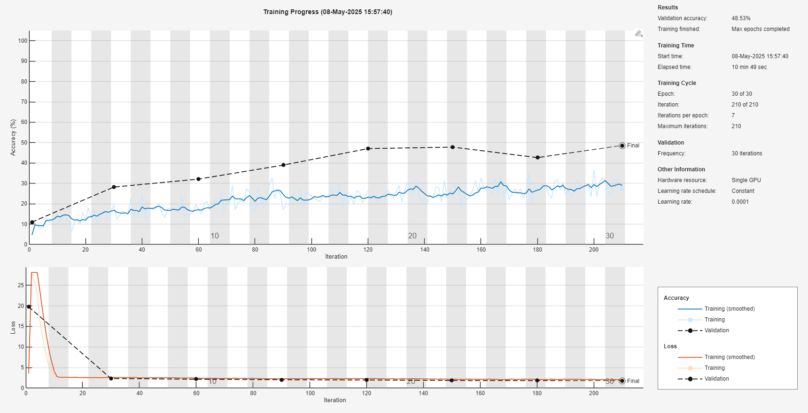
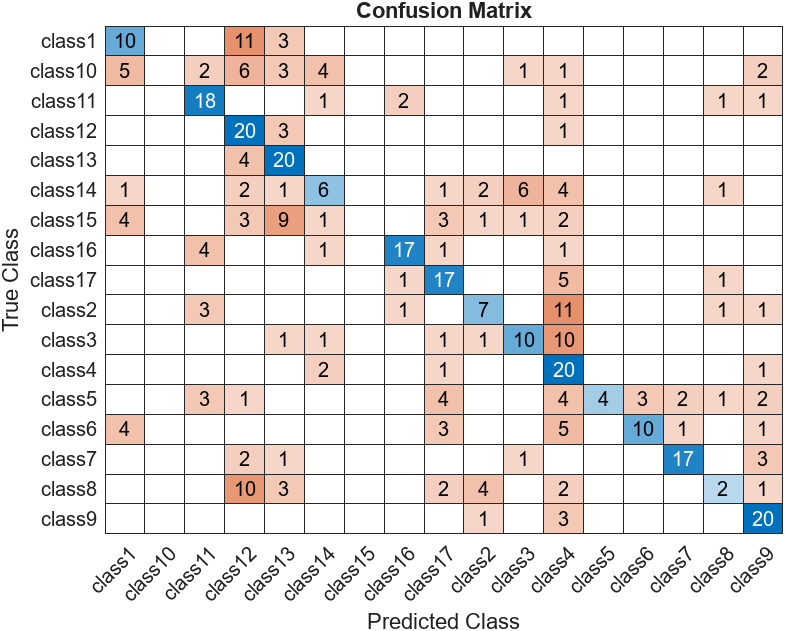
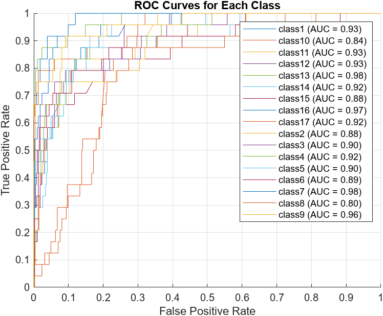
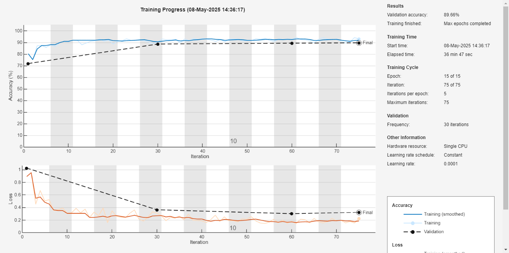
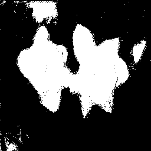
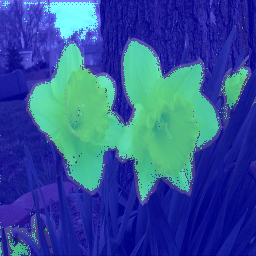

# Flower Classification and Segmentation

A deep-learning computer vision project exploring **multi-class image classification and semantic segmentation** using custom CNN and U-Net architectures in MATLAB.

This project was originally developed as part of a Computer Vision module during my MSci Computer Science degree at the University of Nottingham. It tackles two related computer vision tasks using the Oxford 17 Category Flower Dataset and annotated flower segmentation data:

1. **Flower classification** — a custom convolutional neural network trained to distinguish between 17 flower categories.
2. **Flower segmentation** — a U-Net model trained to distinguish flower pixels from the image background.

The custom classifier achieved **48.53% validation accuracy**, while the U-Net segmentation experiment achieved a reported **89.35% pixel classification accuracy**.

> **Note:** This is an academic deep-learning project rather than a production-ready computer vision system. The repository preserves the original modelling approaches and experimental results while restructuring the source code and outputs for clarity.

## Project Overview

The project investigates two fundamental computer vision problems: determining **what an image contains** through classification and determining **where an object appears within an image** through semantic segmentation.

### Classification

The classification system uses a custom convolutional neural network trained from scratch on the **Oxford 17 Category Flower Dataset**.

The pipeline includes:

- Image loading and class labelling using MATLAB `imageDatastore`
- 70/30 training and validation split
- Image resizing to 256 × 256 RGB
- Training-time data augmentation
- Custom CNN architecture
- Batch normalisation
- ReLU activation
- Max pooling
- Dropout regularisation
- Adam optimisation
- GPU-accelerated training
- Confusion-matrix evaluation
- Per-class ROC curves and AUC analysis

### Semantic Segmentation

The second part of the project performs binary semantic segmentation, classifying each image pixel as either:

- `flower`
- `background`

A **U-Net** architecture is trained using paired flower images and pixel-level segmentation labels.

The segmentation pipeline includes:

- Image and pixel-label datastores
- Randomised training and validation split
- U-Net architecture
- Adam optimisation
- Validation during training
- Pixel-level prediction
- Binary mask generation
- Visual segmentation overlays

## Classification Architecture

The classification model was implemented as a custom CNN rather than using transfer learning or a pretrained feature extractor.

The architecture consists of three convolutional stages followed by fully connected classification layers:

```text
Input Image
256 × 256 × 3
      │
      ▼
3 × 3 Convolution — 32 filters
Batch Normalisation
ReLU
      │
      ▼
2 × 2 Max Pooling
      │
      ▼
3 × 3 Convolution — 64 filters
Batch Normalisation
ReLU
      │
      ▼
2 × 2 Max Pooling
      │
      ▼
3 × 3 Convolution — 128 filters
Batch Normalisation
ReLU
      │
      ▼
Fully Connected — 256
ReLU
      │
      ▼
Dropout — 0.5
      │
      ▼
Fully Connected — 17
      │
      ▼
Softmax
      │
      ▼
Flower Class
```

The network was trained for **30 epochs** using the Adam optimiser with an initial learning rate of `1e-4`.

Batch normalisation was used throughout the convolutional stages to improve training stability, while dropout was introduced before the final classification layer to reduce overfitting.

## Data Preparation and Augmentation

The Oxford 17 Category Flower Dataset contains images belonging to 17 different flower categories.

The original dataset is reorganised into class-specific directories using `organiseFiles.m`, allowing MATLAB to infer labels from directory names.

Images are resized to:

```text
256 × 256 × 3
```

The dataset is then split into:

```text
70% training
30% validation
```

To improve generalisation, several random transformations are applied to the training images:

- Rotation between -30° and +30°
- Scaling between 0.8× and 1.2×
- Horizontal translation of up to 10 pixels
- Vertical translation of up to 10 pixels
- Random horizontal reflection

Validation images are resized to the required network dimensions without augmentation.

## Classification Results

After 30 epochs, the custom CNN achieved a **validation accuracy of 48.53%**.

Although this represents moderate overall classification performance, performance varied considerably between flower categories.

In the recorded validation run, **Classes 4, 9, 12 and 13 were correctly classified for all 20 validation examples**. Classes 7 and 11 also performed strongly.

Other categories proved substantially more difficult. In particular, Classes 1, 8, 14 and 15 exhibited greater levels of confusion with other flower categories, suggesting that the relatively small custom network struggled to distinguish some visually similar classes.

### Training Progress



The model converged relatively quickly during the original training run before validation performance began to plateau.

### Confusion Matrix



The confusion matrix demonstrates the substantial variation in performance between flower categories. Some visually distinct categories were recognised reliably, while others were frequently confused with similar classes.

### ROC Curves



One-vs-rest ROC curves were generated for each of the 17 flower classes using the model's prediction scores.

Most classes achieved relatively strong AUC values despite the lower overall classification accuracy, while weaker classes — particularly Class 8 — demonstrated poorer discrimination.

These results provide a more detailed view of model performance than overall validation accuracy alone.

## Semantic Segmentation

The second component approaches flower recognition as a **pixel-level classification problem**.

Rather than predicting a single category for an entire image, the segmentation network determines whether each individual pixel belongs to:

```text
flower
```

or:

```text
background
```

The segmentation pipeline is:

```text
Input Image
256 × 256 × 3
      │
      ▼
Image Datastore
+
Pixel Label Datastore
      │
      ▼
Training / Validation Split
      │
      ▼
U-Net
      │
      ▼
Pixel-Level Classification
      │
      ├───────────────┐
      ▼               ▼
 Background         Flower
      │               │
      └───────┬───────┘
              ▼
      Segmentation Mask
              │
              ▼
       Visual Overlay
```

## U-Net Architecture

The segmentation model uses **U-Net**, an encoder-decoder architecture designed for semantic segmentation.

U-Net combines a contracting encoder path, which learns increasingly high-level image features, with a decoder that reconstructs spatial information for pixel-level classification.

Skip connections between corresponding encoder and decoder stages allow spatial information from earlier layers to be retained during reconstruction.

The model was configured for:

```text
Input size:       256 × 256 × 3
Output classes:   2
Classes:          flower / background
Epochs:           15
Mini-batch size:  4
Optimiser:        Adam
Learning rate:    1e-4
```

The original segmentation experiment was trained on CPU.

## Segmentation Results

The U-Net experiment achieved a reported **89.35% pixel classification accuracy** during the original evaluation.

The model was able to distinguish flower regions from the surrounding background effectively. Some prediction errors remained around flower boundaries and visually complex regions, demonstrating the additional difficulty of precise pixel-level classification.

### Training Progress



The segmentation model reached high accuracy relatively quickly during training, demonstrating the suitability of U-Net for the foreground-background segmentation task.

### Predicted Flower Mask

The trained model can generate a binary mask identifying pixels classified as belonging to a flower.



### Segmentation Overlay

The predicted labels can also be overlaid onto the original image to provide a visual representation of the segmentation result.



The example above demonstrates the model identifying the primary flower regions while also showing some imperfections around object boundaries.

## Project Structure

```text
.
├── classification/
│   ├── classification.m
│   └── organiseFiles.m
│
├── segmentation/
│   ├── segmentation.m
│   └── testSegnet.m
│
├── results/
│   ├── classificationTrainingProgress.png
│   ├── confusion_matrix.png
│   ├── flower_mask.png
│   ├── roc_curves.png
│   ├── segmentation_overlay.png
│   ├── segnetTrainingProgress.png
│   └── segnetTrainingTextOutput.txt
│
├── README.md
└── .gitignore
```

The original datasets, trained MATLAB network files and coursework report are intentionally excluded from the repository.

Locally, trained models are stored under:

```text
models/
├── classnet.mat
└── segnet.mat
```

These files are excluded from Git because of their size.

## Running the Project

### Requirements

The project was developed using **MATLAB and the Deep Learning Toolbox**.

The classification experiment is configured to use GPU acceleration:

```matlab
'ExecutionEnvironment', 'gpu'
```

The original segmentation experiment was trained on CPU.

The datasets and pretrained network files are not included in this repository.

## Classification Dataset

The classification component uses the **Oxford 17 Category Flower Dataset**.

The scripts expect the original images to be available locally under:

```text
17flowers/
└── 17flowers/
```

Running:

```text
classification/organiseFiles.m
```

reorganises the original images into class-specific directories:

```text
17flowers_split/
├── class1/
├── class2/
├── class3/
├── ...
└── class17/
```

Each class contains 80 flower images.

The resulting directory names are used by MATLAB's `imageDatastore` to assign the corresponding class labels.

## Training the Classifier

Run:

```text
classification/classification.m
```

The script:

1. Loads the organised 17-class flower dataset.
2. Creates 70/30 training and validation partitions.
3. Applies data augmentation to the training images.
4. Constructs the custom CNN.
5. Trains the network using Adam.
6. Saves the trained network.
7. Evaluates validation accuracy.
8. Generates a confusion matrix.
9. Calculates and plots per-class ROC curves and AUC values.

The generated network is stored locally under:

```text
models/classnet.mat
```

The confusion matrix and ROC curves are written to:

```text
results/
```

## Segmentation Dataset

The segmentation component uses flower images paired with pixel-level annotations.

The scripts expect the local dataset structure:

```text
daffodilSeg/
└── daffodilSeg/
    ├── ImagesRsz256/
    └── LabelsRsz256/
```

`ImagesRsz256` contains the input images, while `LabelsRsz256` contains the corresponding pixel-level ground-truth labels.

## Training the Segmentation Model

Run:

```text
segmentation/segmentation.m
```

The script:

1. Loads the flower images.
2. Loads the corresponding pixel labels.
3. Creates training and validation partitions.
4. Combines images with their corresponding segmentation masks.
5. Constructs the U-Net.
6. Trains the network using Adam.
7. Saves the resulting model locally.

The trained network is stored as:

```text
models/segnet.mat
```

## Testing the Segmentation Model

Once the U-Net has been trained, run:

```text
segmentation/testSegnet.m
```

The script loads the trained model and an example flower image before performing semantic segmentation.

It then generates:

```text
results/flower_mask.png
results/segmentation_overlay.png
```

The first contains a binary representation of pixels classified as flowers, while the second overlays the model's predictions onto the original image.

## Technologies and Techniques

- MATLAB
- Deep Learning Toolbox
- Convolutional Neural Networks
- U-Net
- Semantic Segmentation
- Multi-class Image Classification
- Data Augmentation
- Batch Normalisation
- Dropout
- Adam Optimisation
- GPU-accelerated Training
- Image Datastores
- Pixel Label Datastores
- Confusion Matrices
- ROC Curves
- AUC Evaluation

## Limitations

This project was developed as university coursework and was intended to explore computer vision and deep-learning techniques rather than provide a production-ready image-recognition system.

The classification model is a relatively small CNN trained from scratch on a limited dataset. Its **48.53% validation accuracy** demonstrates that the model learned useful visual representations, but also that its ability to generalise between visually similar flower categories was limited.

The experiment also uses a training-validation split rather than maintaining a completely independent held-out test set, limiting the strength of conclusions that can be drawn about performance on unseen data.

The segmentation task produced substantially stronger results, with a reported **89.35% pixel classification accuracy**. However, pixel accuracy alone does not provide a complete assessment of segmentation quality, particularly when the sizes of foreground and background regions differ significantly.

The segmentation outputs also demonstrate some inaccuracies around object boundaries.

## How I Would Build It Today

The main area I would revisit is the classification architecture.

The original project deliberately trained a relatively small custom CNN from scratch, achieving 48.53% validation accuracy. With a dataset of this size, I would now favour **transfer learning using a pretrained visual backbone**, fine-tuning it for the 17 flower categories rather than learning the complete visual representation from scratch.

This could provide substantially stronger feature extraction while requiring less task-specific training data.

I would also introduce a more rigorous experimental pipeline, including:

- Separate training, validation and held-out test datasets
- Reproducible random seeds
- Transfer learning with a pretrained backbone
- Model checkpointing
- Early stopping
- Learning-rate scheduling
- Systematic hyperparameter optimisation
- Per-class precision, recall and F1 scores
- Automated experiment tracking
- More systematic augmentation experiments
- Analysis of visually similar classes

Rather than assuming that simply increasing the number of training epochs would improve the classifier, I would monitor training and validation performance and use early stopping and checkpointing to identify the model with the strongest generalisation performance.

For segmentation, I would retain an encoder-decoder approach such as U-Net while investigating pretrained encoders and alternative modern segmentation architectures.

I would also expand evaluation beyond pixel accuracy to include metrics such as:

- **Intersection over Union (IoU)**
- **Dice coefficient**
- Per-class precision and recall

These would provide a more meaningful assessment of segmentation quality, particularly around flower boundaries.

For deployment, the selected models could be exposed through a lightweight inference service. A user could upload a flower image and receive:

- Predicted flower category
- Classification confidence scores
- Flower segmentation mask
- Visual segmentation overlay

This would separate model training from inference and turn the original experimental pipeline into a usable computer vision application.

## Background

This project was developed as part of a **Computer Vision module** during my MSci Computer Science degree at the University of Nottingham.

The coursework provided an opportunity to explore two complementary deep-learning tasks: image-level classification and pixel-level semantic segmentation.

The classification component demonstrated the process of designing, training and evaluating a CNN from scratch, including augmentation, regularisation and multi-class performance analysis. The segmentation component extended this work to pixel-level prediction using a U-Net architecture.

The project achieved **48.53% validation accuracy for 17-class flower classification** and a reported **89.35% pixel classification accuracy for flower segmentation**, while also highlighting clear opportunities for improvement through transfer learning, stronger evaluation methodology and modern model-development practices.